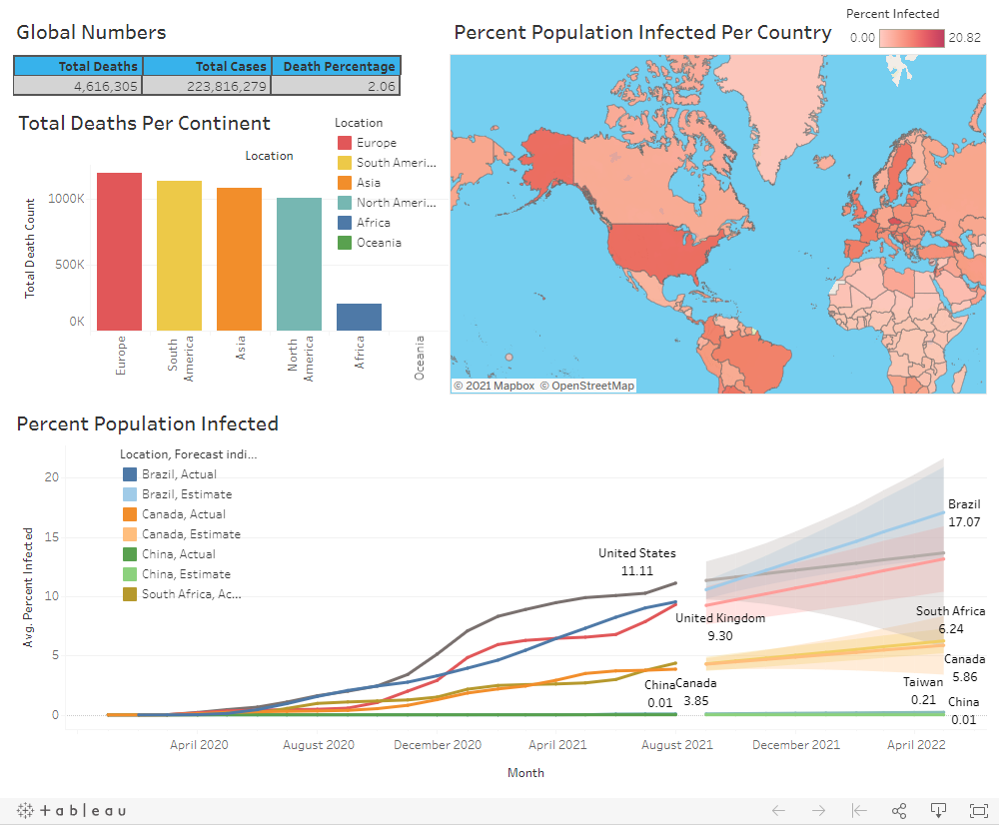

## Covid-19 Data Dashboard

### Description

Statistics and research data was sourced from [Our World in Data](https://ourworldindata.org/covid-deaths) to visualize how covid-19 has spread over time and between countries. The data was explored and cleaned with Microsoft SQL and visualized in Tableau.

### Finished Product

The interactive dashboard is hosted on Tableau Public and can be found [here](https://public.tableau.com/app/profile/kyle.rozic/viz/CovidVisualization_16319417831480/Dashboard1?publish=yes)